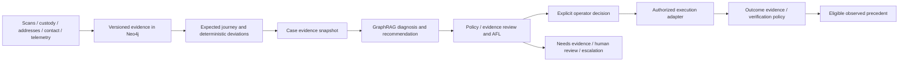

# Architecture, custody and operational state

Design 2026-10-08. All operational values below are synthetic configurable assumptions.

## Separation of responsibilities

An evidence adapter appends observations with source IDs, event time, ingestion time,
dataset/version and verification status. Deterministic derivation compares manifest,
address, journey, custody and policy facts. GraphRAG gathers the relevant connected
evidence and only eligible observed histories. A model proposes diagnoses/actions with
supporting observation IDs and explicit unknowns. A reviewer applies authoritative rules
and bounded reconsideration. Operator approval and authorized external execution remain
separate commands. Verified outcome evidence is the only path into learning statistics.

Never use a model explanation as an observation. Every inference has evidence IDs,
alternative hypotheses and `assessment_kind=inference`. Absence of telemetry is unknown,
not evidence that a vehicle stopped. A customer report remains a report until corroborated;
an operational status remains an assertion until compatible proof reconciles it.

## Network and movement

C2C: sender pickup or branch dropoff → origin custody receipt → origin sorting →
linehaul if intercity → destination sorting/depot → last-mile session → reconciled
delivery or failed attempt and depot return. B2C: organization inventory in its own
OrganizationWarehouse or managed FulfillmentWarehouse → manifest/package allocation →
pickup/network receipt → same network. B2B: organization-to-organization packages, possibly
bulky vehicles/handling and a receiving window. Ownership of goods/facility is distinct
from physical custody and fulfillment responsibility.

Cities form three illustrative clusters: central Riyadh, western Jeddah–Makkah–Madinah,
and eastern Dammam–Khobar–Dhahran–Hofuf–Jubail. Synthetic linehaul segments connect the
clusters; last-mile legs stay within a city unless a scenario explicitly models a remote
delivery. Actual travel distances, schedules and enterprise facilities are not inferred.

Vehicle assignment uses package weight/volume, configured payload/volume limits, handling
compatibility and overlapping assignment intervals. Use last-mile vans, linehaul vans/trucks
and bulky-load vehicles as synthetic classes. A driver is assigned to a vehicle for an
interval, not permanently to every shipment historically connected to that vehicle.

## Chain-of-custody evidence

CustodyEvent records package/shipment, from/to custodian (facility, vehicle or party),
occurred_at, recorded_at, source_ref, transfer/receive/load/unload/deliver/return type,
acknowledgment status, confidence and optional scan/POD references. A planned load is
not a confirmed load. Load/unload events delimit the vehicle association interval.
Transfer missing one required acknowledgment remains incomplete; duplicates are idempotent.
Late-arriving events can reconcile an earlier gap with an AuditEvent rather than overwrite it.

Answer “last custody” as the last corroborated custody event at the requested as-of time,
with its facility/vehicle and the vehicle's valid driver assignment at that time. Return
the next expected event/window, whether matching evidence exists and the earliest gap.
Overlapping contradictory custodians produce HUMAN_REVIEW, not a chosen convenient path.
Derivation must handle out-of-order ingestion, missing scans and multi-package shipments.

GPSObservation establishes vehicle position, accuracy radius, observed_at and source.
Even a contemporaneous confirmed load only links that vehicle observation to an inferred
custody context; it does not establish exact parcel position or continued presence after
an unobserved transfer. Nearby deliveries provide context, not proof that this parcel
was delivered. No metric ranks/blames employees from GPS.

Neutral wording: “Custody evidence becomes incomplete after the confirmed last-mile load”;
“Tracking confirmation conflicts with the recipient's report”; “Traffic explains a route
delay; returned-to-depot evidence accounts for the package.” No driver/recipient accusation.

## Contextual expected journey

A JourneyPlan links each shipment/package to ServiceLevel, ShipmentType, handling constraints,
ordered RouteMilestones, RouteSegments and eligible DeliverySessions. It freezes policy
version, planned windows and promise_at when created. Revisions create a new plan version
with actor/reason and effective_at; they never erase the original promise/deviation.

Each expected milestone has earliest/latest times and a matching predicate, e.g. confirmed
custody receive at destination depot, not any generic scan. A matched actual observation
gives deviation_seconds from the appropriate window; before the window the state is
not_due, within it on_time, after it late, missing after deadline missing, contradictory
evidence conflicted. Unknown inputs yield unknown, not zero delay. Derive as-of a fixed
evaluation clock; never compare old synthetic events to the current real date implicitly.

Illustrative standard/small, express/small and bulky/appointment classes use separate
configurable segment/handling/session windows. A 06:00–16:00 session is explicitly
`synthetic=true`, timezone `Asia/Riyadh`, versioned and configurable; other sessions are
possible. No universal SLA, no claim this is an SPL operating schedule.

TrafficObservation attaches to a segment and interval, with attributed source, estimated
delay range and confidence. Accumulated delay can reduce remaining session capacity.
Recommend next eligible priority session and notification after a confirmed safe return.
Explained delay can still breach the original promise; updated ETA does not erase breach.

After session end plus configured reconciliation grace, OUT_FOR_DELIVERY requires either
corroborated delivery or failed attempt + returned-to-depot custody. Otherwise derive
UNRECONCILED_CUSTODY and NEEDS_MORE_EVIDENCE/HUMAN_REVIEW. Escalate risk if later expected
milestones also go missing. Never convert a missing event directly into LOST.

## Case and action lifecycle

| Transition | Required evidence/authority |
|---|---|
| OPEN → INVESTIGATING |Accepted case intake; evidence snapshot/version and analysis run ID|
| INVESTIGATING → RECOMMENDATION_READY |Valid proposal, evidence IDs, applicable policy and observed citations or explicit absence|
| RECOMMENDATION_READY → AWAITING_APPROVAL |Model review passes; no execution implied|
| AWAITING_APPROVAL → ACTION_INITIATED |Authorized OperatorDecision approves current proposal/version; external adapter acknowledges an idempotent command|
| ACTION_INITIATED → AWAITING_OUTCOME |Execution receipt/reference recorded; observation still pending|
| AWAITING_OUTCOME → RESOLVED |Outcome evidence passes the case-specific verification policy with authorized verifier and timestamp|
| Any open state → NEEDS_MORE_EVIDENCE / HUMAN_REVIEW / ESCALATED |Missing/contradictory evidence, exhausted retry budget, model failure or bounded review rejection|
| Proposal rejection |Recommendation/OperatorDecision becomes REJECTED; case remains unresolved and can return to INVESTIGATING. A visible case REJECTED state refers to the current proposal, not a false complaint.|
| RESOLVED → REOPENED |New complaint/conflicting evidence; retain prior outcome and record supersession/invalidation instead of deleting history|

Resolution evidence is action-specific: delivery receipt may support delivery outcome;
address correction alone may support “address data corrected” while delivery remains pending.
Do not collapse successful administrative action into successful parcel delivery.
Reviewer verdict, operator decision, external receipt and verified outcome are separate nodes.

## Queue, audit, notification and time filtering

Future Process queue is sequential initially, with durable per-case lease, run ID,
evidence_version, optimistic transition version and bounded iteration count. Record every
completed/error attempt; never silently rerun failures until a favorable result. Recheck
evidence/version before proposal recording and approval. A crash replays the same run/command
ID and outbox event; expired leases resume safely. No worker resolves cases by default.

AuditEvent appends actor/type, occurred_at/recorded_at, case/run/entity IDs, from/to state,
policy/evidence/model/prompt versions, reason code, parent event and request idempotency key.
Track evidence retrieval, classifier/confidence, recommendation, review, revision, operator
decision, action acknowledgment, outcome, reopen and notification. Never store provider
thinking, raw credentials or unbounded prompts/exceptions in audit/UI.

Metric denominators are explicit: analyzed runs/cases, accepted recommendations, reviewer
interventions, escalations, insufficient-evidence cases, verified outcomes (success/failure
by action type), reopened cases, malformed calls, latency and actual model/fallback. Pending
is excluded from success/failure rates; model acceptance is not operational correctness.
Ground-truth agreement is available only for adjudicated/reference-backed subsets.

Notifications are a transactional outbox design. `NOTIFICATION_MODE=dry_run` is default
and must make zero provider calls, even with a configured key. A fake adapter exercises
resolution, next-session schedule, information request, priority and customer-action events.
Future Resend live mode requires explicit operator authorization, consent/channel policy,
verified sender and recipient constraints. Keep keys backend-only. Maintain durable
application deduplication beyond the provider's 24-hour idempotency window.
[Resend idempotency documentation](https://resend.com/docs/dashboard/emails/idempotency-keys).
Provider “delivered” means email status, not parcel delivery or case resolution.

Today means local midnight-to-next-midnight, converted to UTC; last 24h is a rolling interval.
Week/month use configured local calendar boundaries; custom ranges validate start<end.
All are half-open `[start,end)`, using explicit operational/audit event time. Distinguish
event occurrence from ingestion; late-arriving evidence can appear in different views.
Critical/stalled/SLA-risk/dispute/custody-gap/needs-evidence/human-review/resolved/reopened
filters use deterministic case fields with documented unknowns, not arbitrary model text.

Future UI: operational command center with queue, evidence/custody timeline, hypothesis,
remedy, review and approval separated; geographic journey as supporting evidence. Animate
resolution only after verified state transition. Keep AR/EN, meaningful process direction,
keyboard/text alternatives, reduced motion and progressive disclosure. Defer implementation
until data/state contracts are stable.
